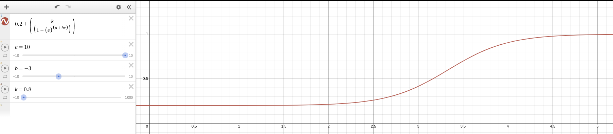

# Autonomous Copter System

Simple UAV System using ROS. This created primarily for my Final Project on Bachelor Degree</br></br>

## Dependencies
1. [Ardupilot & MAVProxy](https://github.com/Intelligent-Quads/iq_tutorials)
2. [Gazebo & ArduPilot Plugin](https://github.com/Intelligent-Quads/iq_tutorials/blob/master/docs/installing_gazebo_arduplugin.md)
3. ROS [Melodic](http://wiki.ros.org/melodic/Installation/Ubuntu)/[Neotic](http://wiki.ros.org/noetic/Installation/Ubuntu) & [MAVROS](https://github.com/Intelligent-Quads/iq_tutorials/blob/master/docs/installing_ros.md)
4. [OpenCV](https://github.com/opencv/opencv/tree/5.x)
5. [JetsonGPIO](https://github.com/pjueon/JetsonGPIO) (Jetson) or [WiringPI](https://www.digikey.com/en/maker/blogs/2019/how-to-use-gpio-on-the-raspberry-pi-with-c) (Rasberry Pi)
6. [Boost](https://stackoverflow.com/questions/12578499/how-to-install-boost-on-ubuntu)
7. [JSON C++](https://github.com/open-source-parsers/jsoncpp)
8. Curses
9. [Curl](https://www.cyberciti.biz/faq/how-to-install-curl-command-on-a-ubuntu-linux)

## Install
```
cd ~/catkin_ws/src
sudo apt install ncurses-dev libnotify-dev -y

git clone https://github.com/Balisa16/UAV-System.git emiro
cd emiro
echo "export EMIRO_PATH=$(pwd)" >> ~/.bashrc
echo "source $(pwd)/shell/emiro.sh" >> ~/.bashrc
source ~/.bashrc
git submodule update --init
catkin build emiro
```
if there an error like this `src/emiro/release/manual: error while loading shared libraries: libLogger.so: cannot open shared object file: No such file or directory
` then execute this in top of workspace in this case in `~/catkin_ws`
```
cp src/emiro/release/libemiro.so devel/lib/
cp build/emiro/thirdparty/Logger/libLogger.so devel/lib/
```

## Optional
```
pip3 install pyautogui
```

# Autonomous Landing System
This project using simple object detection by color to determine landing pad position. To reducing noise, i am used simple sigmoid. Here is sigmoid model.

